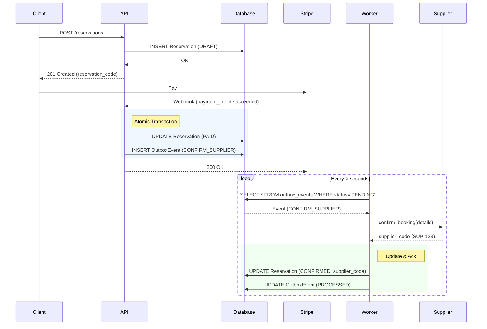

# Sequence Diagram: Reservation Flow

```mermaid
sequenceDiagram
    participant Client
    participant API
    participant DB as Database
    participant Stripe
    participant Worker
    participant Supplier

    %% 1. Create Reservation
    Client->>API: POST /reservations
    API->>DB: INSERT Reservation (DRAFT)
    DB-->>API: OK
    API-->>Client: 201 Created (reservation_code)

    %% 2. Payment (Async)
    Client->>Stripe: Pay
    Stripe->>API: Webhook (payment_intent.succeeded)

    rect rgb(240, 248, 255)
        note right of API: Atomic Transaction
        API->>DB: UPDATE Reservation (PAID)
        API->>DB: INSERT OutboxEvent (CONFIRM_SUPPLIER)
    end

    API-->>Stripe: 200 OK

    %% 3. Confirmation (Async Worker)
    loop Every X seconds
        Worker->>DB: SELECT * FROM outbox_events WHERE status='PENDING'
        DB-->>Worker: Event (CONFIRM_SUPPLIER)

        Worker->>Supplier: confirm_booking(details)
        Supplier-->>Worker: supplier_code (SUP-123)

        rect rgb(240, 255, 240)
            note right of Worker: Update & Ack
            Worker->>DB: UPDATE Reservation (CONFIRMED, supplier_code)
            Worker->>DB: UPDATE OutboxEvent (PROCESSED)
        end
    end
```
