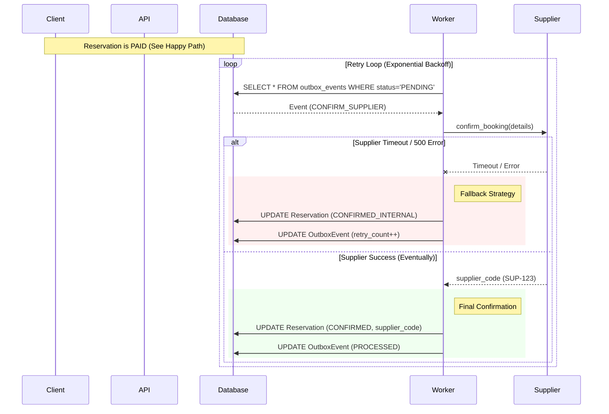

# Sequence Diagram: Supplier Failure & Recovery

```mermaid
sequenceDiagram
    participant Client
    participant API
    participant DB as Database
    participant Worker
    participant Supplier

    Note over Client, DB: Reservation is PAID (See Happy Path)

    loop Retry Loop (Exponential Backoff)
        Worker->>DB: SELECT * FROM outbox_events WHERE status='PENDING'
        DB-->>Worker: Event (CONFIRM_SUPPLIER)

        Worker->>Supplier: confirm_booking(details)

        alt Supplier Timeout / 500 Error
            Supplier--xWorker: Timeout / Error

            rect rgb(255, 240, 240)
                note right of Worker: Fallback Strategy
                Worker->>DB: UPDATE Reservation (CONFIRMED_INTERNAL)
                Worker->>DB: UPDATE OutboxEvent (retry_count++)
            end

        else Supplier Success (Eventually)
            Supplier-->>Worker: supplier_code (SUP-123)

            rect rgb(240, 255, 240)
                note right of Worker: Final Confirmation
                Worker->>DB: UPDATE Reservation (CONFIRMED, supplier_code)
                Worker->>DB: UPDATE OutboxEvent (PROCESSED)
            end
        end
    end
```
