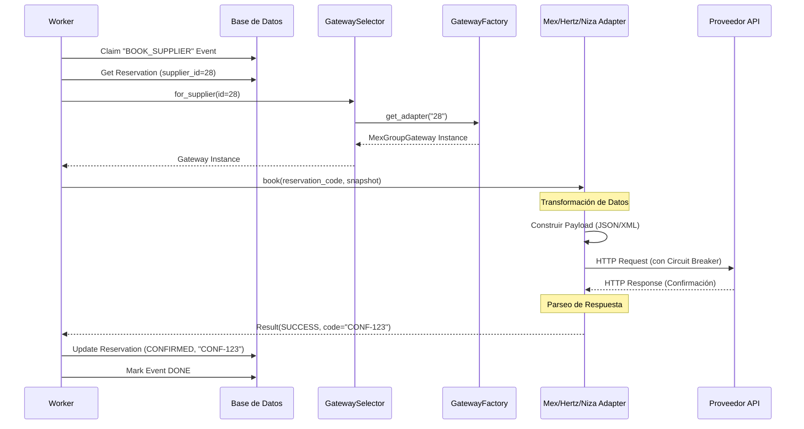

# Documentación de Flujos del Sistema

## 1. Visión General del Proceso de Reserva

El sistema utiliza una arquitectura orientada a eventos (Pattern Transactional Outbox) para desacoplar la recepción de la reserva de la confirmación con el proveedor externo. Esto garantiza que el usuario reciba una respuesta rápida y que la confirmación con proveedores lentos o inestables (Legacy) se maneje de forma robusta en segundo plano.

### Fases del Proceso

#### Fase A: Intención y Creación (Síncrono)
1.  **Cliente** envía `POST /reservations` con el payload inicial.
2.  **API** valida el esquema (`CreateReservationRequest`).
3.  **UseCase** genera un código de reserva (`RES-XXXX`) y persiste la reserva en estado `PENDING`.
4.  **Retorno**: Se devuelve el código de reserva al cliente inmediatamente.

#### Fase B: Pago y Encolado (Síncrono)
1.  **Cliente** envía `POST /reservations/{code}/pay`.
2.  **Gateway de Pago** (Stripe) procesa el cobro.
3.  **DB Transaction**:
    *   Actualiza estado de reserva a `PAID`.
    *   Inserta un evento en la tabla `outbox_events` con tipo `BOOK_SUPPLIER`.
4.  **Retorno**: Confirmación de pago exitoso.

#### Fase C: Procesamiento Asíncrono (Worker)
1.  **Worker** (proceso en segundo plano) consulta `outbox_events` pendientes.
2.  **Lock**: Bloquea el evento para evitar doble procesamiento.
3.  **Selección**: Instancia el Gateway correcto basado en el `supplier_id` de la reserva.
4.  **Ejecución**: Llama al método `book()` del Gateway específico.
5.  **Resultado**:
    *   **Éxito**: Actualiza reserva a `CONFIRMED`, guarda `supplier_reservation_code` y marca evento como `DONE`.
    *   **Fallo**: Programa reintento (Backoff exponencial) o mueve a `DLQ` (Dead Letter Queue) si excede intentos.

---

## 2. Lógica de Selección de Proveedor

El sistema ahora soporta múltiples protocolos y proveedores heredados. La selección es dinámica y basada en datos.

### Componente: `SupplierGatewaySelector` + `SupplierGatewayFactory`

1.  **Entrada**: El worker lee `reservation.supplier_id` (ej. `28` para Mex Group).
2.  **Routing**:
    *   El `Selector` consulta a la `Factory`.
    *   La `Factory` mantiene un mapa de configuración.
3.  **Instanciación**:
    *   Si `supplier_id == 28` -> Crea instancia de `MexGroupGateway` (REST).
    *   Si `supplier_id == 126` -> Crea instancia de `NizaCarsGateway` (SOAP).
    *   Si `supplier_id == 106` -> Crea instancia de `InfinityGroupGateway` (XML/GET).
4.  **Ejecución**: El Worker invoca `gateway.book(...)` sin conocer los detalles del protocolo subyacente (Polimorfismo).

---

## 3. Flujo de Datos Detallado

### Entrada (JSON Request)
El cliente envía un JSON con datos normalizados y un bloque específico para el proveedor.

```json
{
  "supplier_id": 28,
  "pickup_datetime": "2026-03-01T10:00:00",
  "supplier_specific_data": {
    "rate_code": "IPAMOM",
    "class_code": "ECAR",
    "rate_id": "MEX-R-998877"
  },
  ...
}
```

### Transformación 1: Persistencia (SQL)
*   Los datos "core" se guardan en columnas (`pickup_datetime`, `supplier_id`).
*   Los datos complejos (`supplier_specific_data`) se serializan o se asume que provienen de una consulta de disponibilidad previa (snapshot).

### Transformación 2: Gateway Adapter (Python -> Protocolo Ext)
Cada Gateway transforma el objeto de dominio (`Reservation`) y el snapshot en el formato nativo del proveedor.

| Proveedor | Entrada (Snapshot) | Transformación | Salida (Protocolo) |
| :--- | :--- | :--- | :--- |
| **Mex Group** | `rate_code`, `class_code` | Diccionario Python | JSON Body (REST) |
| **Niza Cars** | `Group`, `RateCode` | `xml.etree` Builder | SOAP Envelope (XML string) |
| **Infinity** | `vendor_rate_id` | f-string Template | Query Param `?XML=<OTA_VehResRQ...>` |
| **Noleggiare**| `sipp_code` | `xml.etree` Builder | SOAP 1.1 Envelope |

### Salida (Confirmación)
El Gateway parsea la respuesta cruda (JSON, XML, SOAP Body), extrae únicamente el **ID de Confirmación** (`supplier_reservation_code`) y lo retorna normalizado en un `SupplierBookingResult`.

---

## 4. Diagrama de Secuencia (Confirmación)



## 5. Manejo de Errores y Resiliencia

### Circuit Breaker (`async_supplier_breaker`)
*   Envuelve cada llamada `gateway.book()`.
*   Si un proveedor falla consecutivamente (ej. Timeout > 30s), el circuito se abre.
*   Las reservas subsiguientes fallan rápido (Fail Fast) sin esperar timeout, protegiendo recursos.

### Reintentos (Worker)
*   Si el Gateway retorna error (o Circuit Breaker lanza excepción):
*   El Worker incrementa `attempts`.
*   Calcula `next_attempt_at` (Backoff: 15s, 30s, 60s...).
*   Actualiza el evento en DB para ser procesado en el futuro.

### Dead Letter Queue (DLQ)
*   Si `attempts > 5`, el evento se mueve a la tabla `outbox_dead_letters`.
*   Requiere intervención manual (Soporte).
