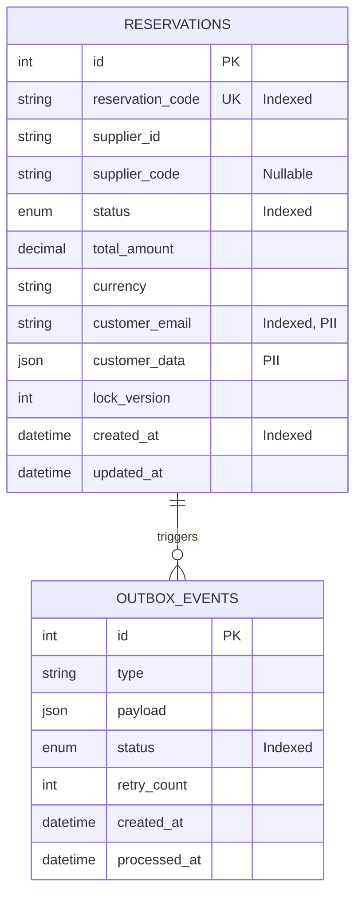

# Entity Relationship Diagram

```mermaid
erDiagram
    RESERVATIONS {
        int id PK
        string reservation_code UK "Indexed"
        string supplier_id
        string supplier_code "Nullable"
        enum status "Indexed"
        decimal total_amount
        string currency
        string customer_email "Indexed, PII"
        json customer_data "PII"
        int lock_version
        datetime created_at "Indexed"
        datetime updated_at
    }

    OUTBOX_EVENTS {
        int id PK
        string type
        json payload
        enum status "Indexed"
        int retry_count
        datetime created_at
        datetime processed_at
    }

    %% Logic Relationship (Not FK enforced in DB for decoupling but logical link exists)
    RESERVATIONS ||--o{ OUTBOX_EVENTS : "triggers"
```
