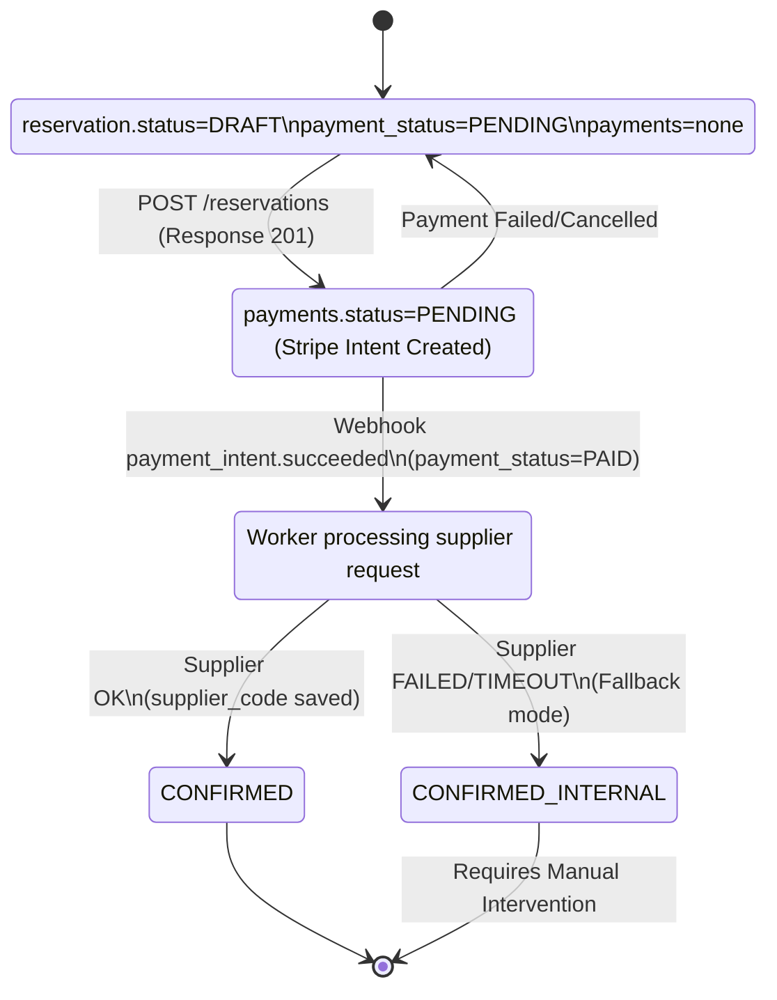

# State Machine - Fase B (Actualizado)

## Diagrama (alto nivel)

## Transiciones y estados combinados
- **Creación**: `status=DRAFT`, `payment_status=PENDING`.
- **Checkout**: `status=PENDING_PAYMENT`, `payment_status=PENDING`.
- **Pago OK**: `status=PENDING_SUPPLIER`, `payment_status=PAID`. **Punto de no retorno**.
- **Confirmado**: `status=CONFIRMED`, `payment_status=PAID`.
- **Fallback**: `status=CONFIRMED_INTERNAL`, `payment_status=PAID`.

## Reglas de progreso
- **Irreversibilidad**: Una vez `PAID`, no se vuelve a `PENDING` ni `DRAFT`.
- **Idempotencia**: Clave en `POST` y en Webhooks.
- **Concurrencia**: `lock_version` obligatorio para transiciones.

## Mapping de errores a HTTP
- **422**: Validación de datos.
- **409**: Conflicto de estado o idempotencia.
- **201**: Reserva creada (DRAFT).
- **200**: Consulta de recibo.
